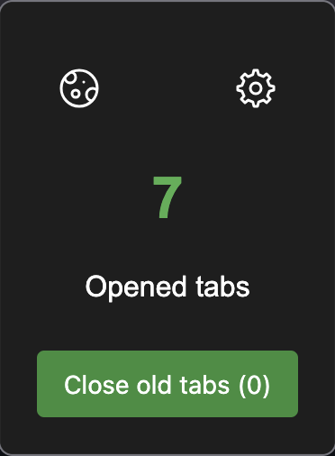

# tabs-counter

A small web extension that counts the number of tabs oppened in your current navigator.

- [Features](#features)  
- [Installation](#installation)  
- [Usage](#usage)   
- [License](#license)

## Features
- Counts the tabs oppened in your navigator.
- You can close the tabs oppened for more than 24 hours with one click only.
- Quick display of the quantity of tabs oppened on the extension's logo.
 
## Installation
- Currently available for **Firefox**
- Working on **Google**
- Not available in official Firefox extensions repository __*for now*__

## Usage
- Click on the extension icon to see the number of tabs currently opened.
- Use the "Close old tabs" button to automatically close tabs that have been opened for more than 24 hours.
- The badge on the extension icon updates in real time when you open or close tabs.

## License
Under MIT License
